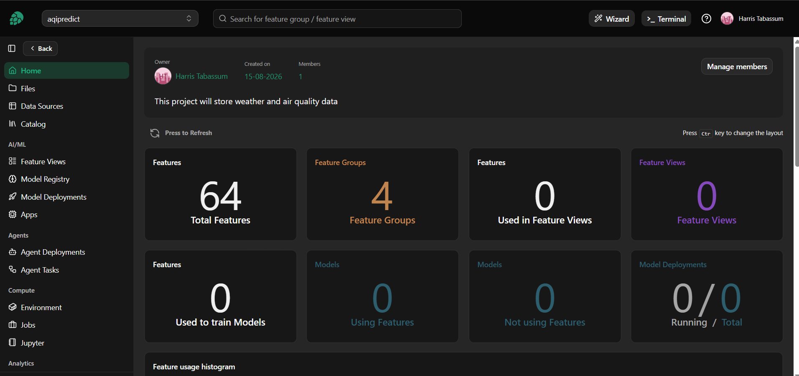
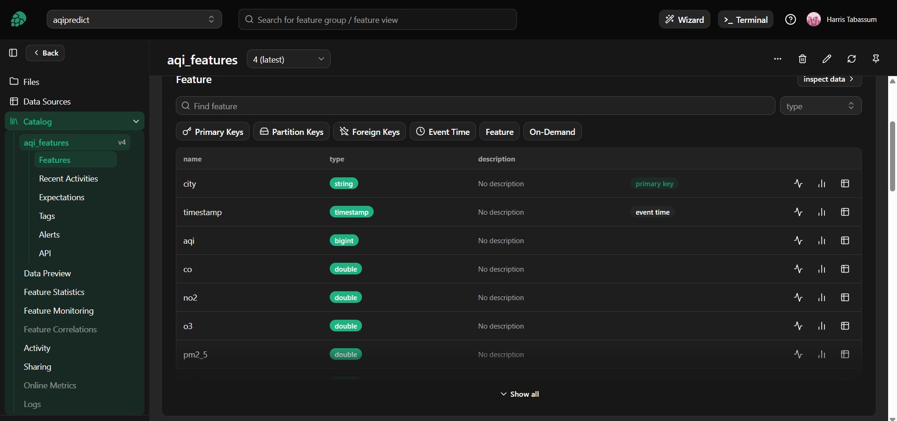
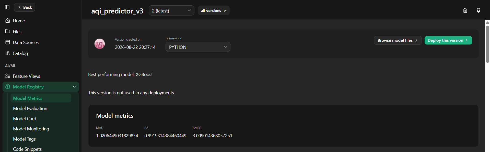
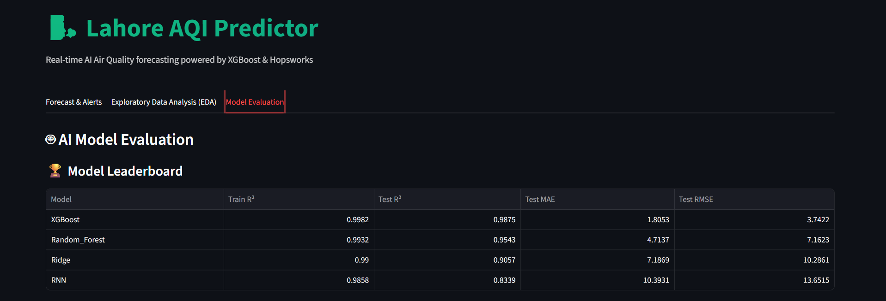
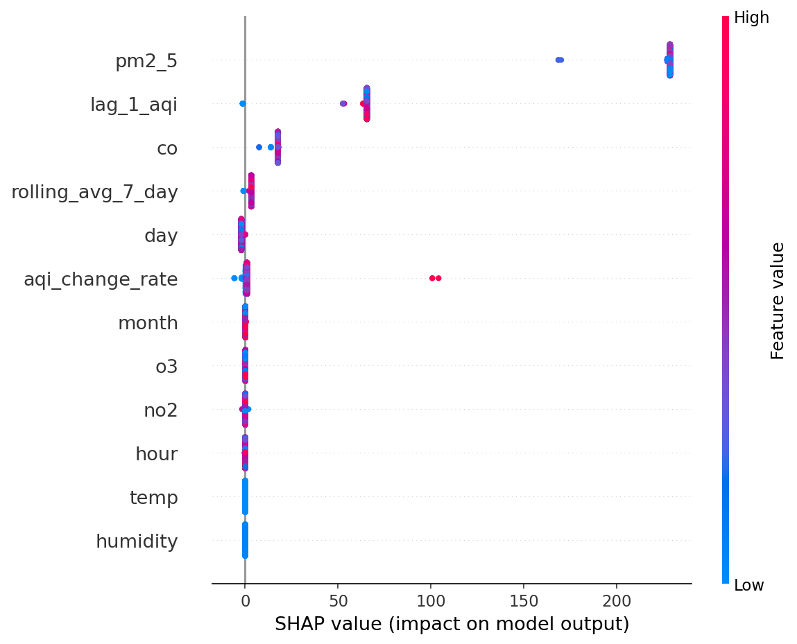
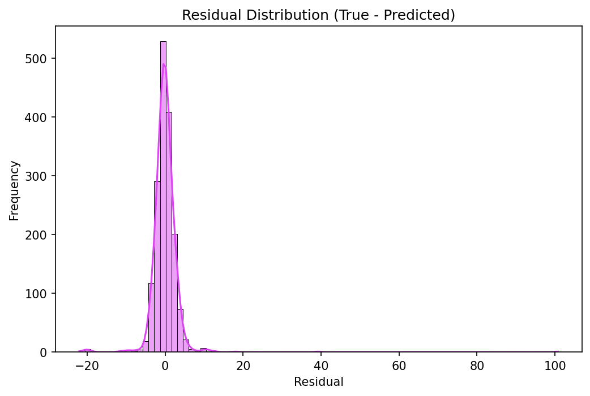
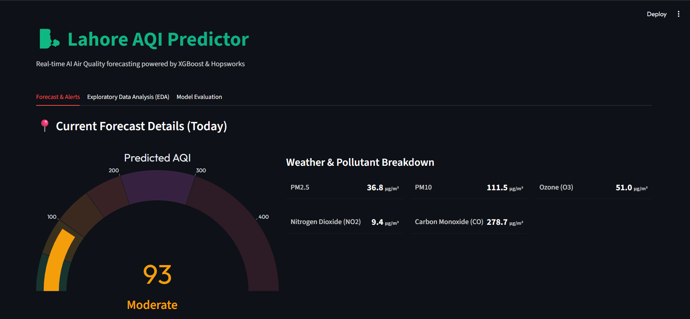
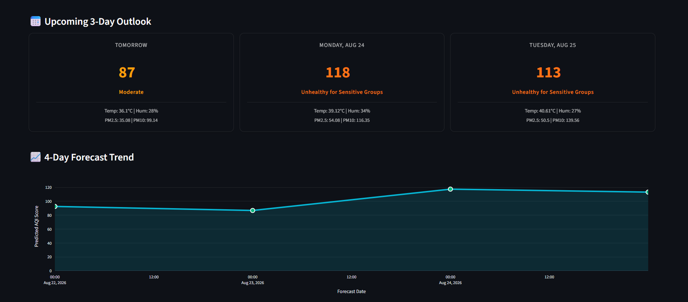
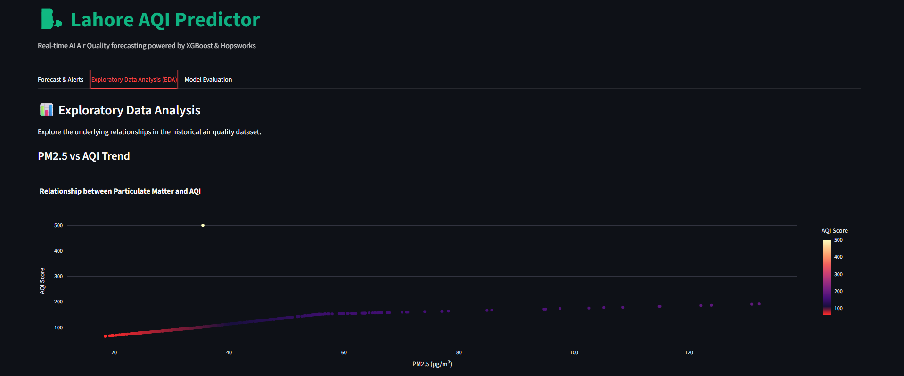
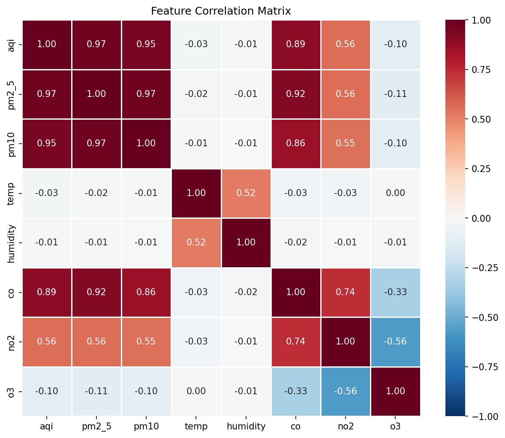

# AQI-Predictor: End-to-End Air-Quality Forecasting for Lahore

*Technical Project Report | Hopsworks, XGBoost, FastAPI, Streamlit, and GitHub Actions*

## Abstract / Executive Summary

AQI-Predictor forecasts Lahore's Air Quality Index (AQI) up to three days ahead using pollution history, OpenWeather forecasts, and engineered temporal features. Hopsworks manages features and models, GitHub Actions automates pipelines, FastAPI serves predictions, and Streamlit presents results. XGBoost was the strongest of four tested algorithms, achieving test R² = 0.9875, MAE = 1.8053, and RMSE = 3.7422.

## System Architecture & Data Pipeline

The feature pipeline collects CO, NO₂, O₃, PM2.5, PM10, temperature, and humidity from OpenWeather. Missing values use chronological interpolation, outliers are capped at the 99th percentile, and continuous variables are standardized. The scaler is versioned with the model.

The correlation matrix shows a 0.97 relationship between PM2.5 and PM10, so PM10 was removed to limit multicollinearity and leakage risk. Lagged AQI, rolling averages, change rate, and calendar fields capture temporal behavior.

Hopsworks reports 64 features across four feature groups. In `aqi_features` version 4, `city` is the primary key and `timestamp` is the event-time field, providing a versioned schema for training and inference.

*Figure 1. Hopsworks project overview and feature-store inventory.*

*Figure 2. Versioned feature schema in the `aqi_features` feature group.*

*Figure 3. Model Registry entry for `aqi_predictor_v3`.*

## CI/CD & Pipeline Automation

GitHub Actions runs scheduled workflows for daily feature ingestion, model retraining, and inference setup. New observations are validated before entering Hopsworks; training jobs compare candidate models and register the winner with its scaler. At startup, the API retrieves the latest approved artifacts. Repository secrets protect service credentials and repeatable jobs reduce manual deployment work.

## Modeling Strategy & Results

Ridge Regression, Random Forest, XGBoost, and a TensorFlow RNN were evaluated using chronological train and test sets. Their complete results are summarized below.

| Model | MAE (Train) | MAE (Test) | RMSE (Train) | RMSE (Test) | R² (Train) | R² (Test) |
|---|---|---|---|---|---|---|
| Ridge | 6.68 | 7.19 | 10.10 | 10.29 | 0.9900 | 0.9057 |
| Random Forest | 3.83 | 4.71 | 8.30 | 7.16 | 0.9932 | 0.9543 |
| XGBoost | 2.00 | 1.81 | 4.31 | 3.74 | 0.9982 | 0.9875 |
| RNN | 8.61 | 10.39 | 12.02 | 13.65 | 0.9858 | 0.8339 |

*Table 1. Model evaluation results on chronological train and test sets.*

**Best Model: XGBoost (Test R² = 0.9875).**

*Figure 4. Comparative model leaderboard in the evaluation tab.*

SHAP ranks PM2.5, lagged AQI, and CO as the leading drivers, while residuals remain concentrated near zero. The booster is stored as native XGBoost `.json` to avoid cross-platform pickle problems. Hopsworks lists `aqi_predictor_v3` version 2 with R² = 0.9919, MAE = 1.0206, and RMSE = 3.0090.

*Figure 5. SHAP feature impacts on model output.*

*Figure 6. Residual distribution (true minus predicted).*

## Dashboard & Deployment

FastAPI downloads the latest model and scaler from Hopsworks, retrieves the live three-day weather outlook, transforms the inputs, and returns AQI predictions. The supplied images show the dashboard rather than API documentation, so endpoint names are not inferred.

Streamlit provides *Forecast & Alerts*, *EDA*, and *Model Evaluation* tabs. The screenshot reports AQI 93 ("Moderate") with pollutant details. Forecast cards show 87, 118, and 113, and the Plotly trend highlights the rise into "Unhealthy for Sensitive Groups." AQI above 300 triggers a hazardous warning.

*Figure 7. Current AQI gauge and pollutant breakdown.*

*Figure 8. Three-day outlook and four-day forecast trend.*

The EDA tab shows the PM2.5–AQI relationship and correlation matrix; the evaluation tab presents the leaderboard, SHAP summary, and residuals.

*Figure 9. PM2.5–AQI scatter relationship.*

*Figure 10. Feature correlation matrix.*

## Conclusion

AQI-Predictor combines governed data, automated pipelines, accurate XGBoost forecasting, explainability, and web deployment. Future work should add drift monitoring, prediction intervals, API health checks, and validation during extreme pollution events.